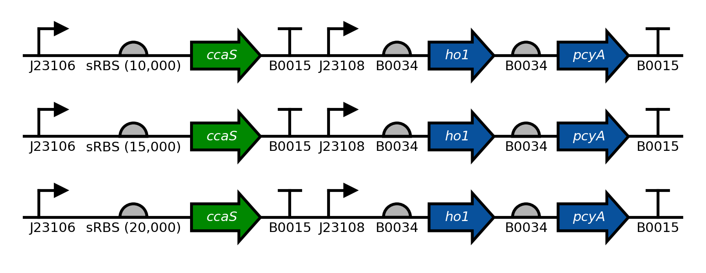

===========================================
Plot Benchling DNA Sequences as SBOL Visual
===========================================

.. _Benchling API Client: https://github.com/castillohair/Benchling-API-Client
.. _dnaplotlib: https://github.com/VoigtLab/dnaplotlib
.. _SBOL Visual: http://sbolstandard.org/visual/

``Benchling2SBOLv`` uses the `Benchling API Client`_ to read a DNA sequence from Benchling, and dnaplotlib_ to instantly plot that sequence as an `SBOL Visual`_ diagram.

Installation
============

Make sure to install dnaplotlib_ and the `Benchling API Client`_ first.

Clone or download this repository, and run the following from a terminal:

.. code::

    python setup.py install

Usage
=====

First, you will need to request an API key from Benchling. You can do that either via email or using the chat function in the Benchling UI.

The following are examples whose successful execution depend on access to the relevant benchling sequences. Therefore, these will probably not work for you unless you use a sequence name that you can access.

A sequence from benchling can be automatically plotted with little more than a single function call:

.. code:: python

    import matplotlib
    import benchlingclient
    import benchling2sbolv

    # The following is necessary so that latex-rendered text is not italicized by
    # default.
    matplotlib.rcParams['mathtext.default'] = 'regular'

    # Specify benchling key
    benchlingclient.LOGIN_KEY = 'write_your_key_here!'

    # Plot one sequence
    # Name: pSR58_6, from base 700 to 3000.
    # Promoter 'PcpcG2-172' has a special latex-formatted label so that it
    # looks prettier.
    # Color of CDSs 'ccaR' and 'sfgfp' are changed to different shades of
    # green.
    # Save figure as "example_one_seq.png"
    seq = benchling2sbolv.plot_sequence(
        seq_name='pSR58_6',
        start_position=700,
        end_position=3000,
        glyph_labels={'PcpcG2-172': r'$P_{\mathit{cpcG2}-172}$'},
        cds_colors={'ccaR': '#aaffaa',
                    'sfgfp': '#00FF00',
                    },
        savefig='example_one_seq.png')

Similarly, many sequences can be plotted stacked on top of one another.

.. code:: python

    # Import packages
    import benchlingclient
    import benchling2sbolv

    # Specify benchling key
    benchlingclient.LOGIN_KEY = 'write_your_key_here!'

    # Plot many sequences
    # Sequence names are 'pSR43_2', 'pSR43_3', 'pSR43_4'.
    # From bases 700 to 5200
    # Colors and label colors for CDSs ho1, pcyA, and sfgfp are custom.
    # Save as "example_many_seqs.png"
    seq = benchling2sbolv.plot_sequences(
        seq_names=['pSR43_2', 'pSR43_3', 'pSR43_4'],
        start_position=700,
        end_position=5200,
        cds_colors={'ho1': '#08519c',
                    'pcyA': '#08519c',
                    'ccaS': '#008800',
                    },
        cds_label_colors={'ho1': '#ffffff',
                           'pcyA': '#ffffff',
                           'ccaS': '#ffffff',
                           },
        savefig='example_many_seqs.png')

Requirements on Benchling DNA Sequences
=======================================

Because ``Benchling2SBOLv`` converts Benchling sequence annotations to SBOL glyphs, it has to assume a few things about the sequence to be plotted:

- Genes or CDSs are annotated with the annotation type "CDS".
- Promoters are annotated with the annotation type "Promoter".
- Ribosome binding sites are annotated with the annotation type "RBS".
- Transcriptional terminators are annotated with the annotation type "Terminator".

All of these are case sensitive.

However, these can be customized. For example, if all genes are annotated with the type "Gene", the following could be added to a script right after importing ``Benchling2SBOLv`` but before plotting anything:

.. code:: python

    benchling2sbolv.ANN_PARTS_MAPPING.append(
        {'annotation': {'type': 'Gene'},
         'part': 'CDS'})

This tells ``Benchling2SBOLv`` to plot annotations with type "Gene" using a CDS glyph as defined by ``dnaplotlib``.

Future work
===========

This package is still in early alpha, and may not support all use cases yet. Suggestions or bug reports are welcome in the "Issues" section of the github repo.
